# 데이터베이스 ERD (Entity Relationship Diagram, 개체-관계 다이어그램)

ERD는 데이터베이스의 테이블(개체)과 테이블 사이의 연결(관계)을 보여 주는 설계도다. 예를 들어 `users`의 사용자 한 명은 여러 건의 `requests`를 요청자 또는 담당자로 가질 수 있고, 요청 한 건에는 여러 `request_comments`와 `request_attachments`가 연결될 수 있다.

기준: 백엔드 초기화 코드와 라우터가 정의하는 SQLite 스키마 (`backend/app.db`).

- 기본 실행 DB: `backend/app.db`
- 협업 전용 실행 DB: `backend/collab_app.db` (협업·사용자 관련 테이블의 별도 사본)
- `app.db`에 아직 생성되지 않은 테이블도 서버 기동 시 `CREATE TABLE IF NOT EXISTS`로 생성될 수 있다.
- `guidebook_pages.category_id`만 DB 외래 키가 정의되어 있다. 나머지는 코드에서 사용하는 **논리 관계**이며, SQLite FK 제약은 없다.

```mermaid
erDiagram
    USERS {
        INTEGER id PK "내부 사용자 ID, 예: 1"
        TEXT username UK "(로그인 사용자명, 예: 김승일)"
        TEXT password_hash "비밀번호 해시, 예: scrypt:..."
        TEXT display_name "화면 표시 이름, 예: 김승일"
        TEXT phone_number "전화번호, 예: 010-1234-5678"
        TEXT role "권한, 예: admin"
        TEXT approval_status "가입 승인 상태, 예: approved"
        TEXT approved_at "승인 시각, 예: 2026-06-24T09:00:00+09:00"
        TEXT approved_by "승인자 사용자명, 예: admin"
        TEXT created_at "가입 시각, 예: 2026-06-24T08:30:00+09:00"
    }

    REQUESTS {
        INTEGER id PK "요청 ID, 예: 42"
        TEXT requester_username "요청자 사용자명, 예: kimseungil"
        TEXT requester_display "요청자 표시 이름, 예: 김승일"
        TEXT assignee_username "담당자 사용자명, 예: lee"
        TEXT assignee_display "담당자 표시 이름, 예: 이영희"
        TEXT text "요청 내용, 예: 반품 송장 확인 부탁드립니다."
        TEXT status "처리 상태, 예: open"
        TEXT created_at "등록 시각, 예: 2026-06-24T09:30:00+09:00"
        TEXT completed_at "완료 시각, 예: 2026-06-24T10:00:00+09:00"
        TEXT acknowledged_at "확인 시각, 예: 2026-06-24T09:35:00+09:00"
    }

    REQUEST_COMMENTS {
        INTEGER id PK "댓글 ID, 예: 7"
        INTEGER request_id "대상 요청 ID, 예: 42"
        TEXT author_username "작성자 사용자명, 예: lee"
        TEXT author_display "작성자 표시 이름, 예: 이영희"
        TEXT text "댓글 내용, 예: 확인 후 처리하겠습니다."
        TEXT created_at "작성 시각, 예: 2026-06-24T09:40:00+09:00"
    }

    REQUEST_ATTACHMENTS {
        INTEGER id PK "첨부파일 ID, 예: 18"
        INTEGER request_id "대상 요청 ID, 예: 42"
        TEXT original_name "원본 파일명, 예: returns.xlsx"
        TEXT stored_name "서버 저장 파일명, 예: 9f7f-returns.xlsx"
        TEXT mime_type "파일 형식, 예: application/vnd.openxmlformats-officedocument.spreadsheetml.sheet"
        INTEGER size "파일 크기(바이트), 예: 28413"
        TEXT created_at "업로드 시각, 예: 2026-06-24T09:31:12+09:00"
    }

    SHARED_FILES {
        INTEGER id PK "공유 파일 ID, 예: 3"
        TEXT original_name "원본 파일명, 예: 업무매뉴얼.pdf"
        TEXT stored_name "서버 저장 파일명, 예: a1b2-업무매뉴얼.pdf"
        TEXT mime_type "파일 형식, 예: application/pdf"
        INTEGER size "파일 크기(바이트), 예: 102400"
        TEXT uploader_username "업로더 사용자명, 예: kimseungil"
        TEXT uploader_display "업로더 표시 이름, 예: 김승일"
        TEXT created_at "업로드 시각, 예: 2026-06-24T11:00:00+09:00"
    }

    SHARED_TODOS {
        INTEGER id PK "공유 할 일 ID, 예: 11"
        TEXT text "할 일 내용, 예: 재고 현황 확인"
        TEXT status "처리 상태, 예: open"
        TEXT created_by_username "등록자 사용자명, 예: kimseungil"
        TEXT completed_by_username "완료자 사용자명, 예: lee"
        TEXT created_at "등록 시각, 예: 2026-06-24T09:00:00+09:00"
        TEXT completed_at "완료 시각, 예: 2026-06-24T13:00:00+09:00"
        TEXT completed_comment "완료 메모, 예: 확인 완료"
    }

    MY_TODOS {
        INTEGER id PK "개인 할 일 ID, 예: 25"
        TEXT owner_username "소유자 사용자명, 예: kimseungil"
        TEXT text "할 일 내용, 예: 거래처에 연락"
        TEXT status "처리 상태, 예: open"
        REAL sort_order "화면 정렬 순서, 예: 1000.0"
        TEXT group_id "그룹 식별자, 예: morning"
        TEXT group_title "그룹 제목, 예: 오전 업무"
        TEXT created_at "등록 시각, 예: 2026-06-24T08:00:00+09:00"
        TEXT completed_at "완료 시각, 예: 2026-06-24T10:30:00+09:00"
    }

    RETURN_SAVED_STATES {
        TEXT username PK "사용자명, 예: kimseungil"
        TEXT payload "반품 화면 상태 JSON, 예: 상태 pending"
        TEXT updated_at "저장 시각, 예: 2026-06-24T09:35:00+09:00"
    }

    GUIDEBOOK_CATEGORIES {
        INTEGER id PK "분류 ID, 예: 1"
        TEXT title "분류명, 예: 반품 업무"
        INTEGER sort_order "화면 정렬 순서, 예: 10"
        TEXT created_at "생성 시각, 예: 2026-06-24T09:00:00+09:00"
        TEXT updated_at "수정 시각, 예: 2026-06-24T10:00:00+09:00"
    }

    GUIDEBOOK_PAGES {
        INTEGER id PK "페이지 ID, 예: 5"
        INTEGER category_id FK "소속 분류 ID, 예: 1"
        TEXT title "페이지 제목, 예: 반품 등록 방법"
        TEXT content "페이지 본문, 예: 반품 건을 조회한 뒤..."
        INTEGER sort_order "화면 정렬 순서, 예: 20"
        TEXT created_at "생성 시각, 예: 2026-06-24T09:00:00+09:00"
        TEXT updated_at "수정 시각, 예: 2026-06-24T10:00:00+09:00"
    }

    ATTENDANCE_MEMBERS {
        INTEGER id PK "출퇴근 대상 ID, 예: 4"
        TEXT name UK "직원 이름, 예: 김승일"
        TEXT created_at "등록 시각, 예: 2026-06-24T08:00:00+09:00"
    }

    ATTENDANCE_RECORDS {
        INTEGER id PK "출퇴근 기록 ID, 예: 101"
        TEXT member_name "직원 이름, 예: 김승일"
        TEXT type "기록 종류, 예: 출근"
        TEXT timestamp "기록 시각, 예: 2026-06-24T08:57:00+09:00"
        TEXT date "기록 일자, 예: 2026-06-24"
    }

    MISONG_ITEMS {
        TEXT id PK "미송 품목 ID, 예: MS-20260624-001"
        TEXT A "원본 A열 값, 예: 거래처명"
        TEXT B "원본 B열 값, 예: 상품코드"
        TEXT C "원본 C열 값, 예: 상품명"
        INTEGER F "수량, 예: 12"
        TEXT original_f "원본 수량 문자열, 예: 12개"
        TEXT owner "담당자, 예: 김승일"
        TEXT added_at "등록 시각, 예: 2026-06-24T09:00:00+09:00"
    }

    MISONG_LOGS {
        INTEGER id PK "미송 이력 ID, 예: 88"
        TEXT item_id "대상 미송 품목 ID, 예: MS-20260624-001"
        TEXT type "처리 종류, 예: 출고"
        INTEGER qty "처리 수량, 예: 3"
        INTEGER remaining_qty "처리 후 잔여 수량, 예: 9"
        TEXT work_date "업무 일자, 예: 2026-06-24"
        TEXT ts "기록 시각, 예: 2026-06-24T14:20:00+09:00"
    }

    USERS ||--o{ REQUESTS : "requester_username"
    USERS ||--o{ REQUESTS : "assignee_username"
    REQUESTS ||--o{ REQUEST_COMMENTS : "request_id"
    REQUESTS ||--o{ REQUEST_ATTACHMENTS : "request_id"
    USERS ||--o{ REQUEST_COMMENTS : "author_username"
    USERS ||--o{ SHARED_FILES : "uploader_username"
    USERS ||--o{ SHARED_TODOS : "created/completed_by_username"
    USERS ||--o{ MY_TODOS : "owner_username"
    USERS ||--o| RETURN_SAVED_STATES : "username"
    GUIDEBOOK_CATEGORIES o|--o{ GUIDEBOOK_PAGES : "category_id (ON DELETE SET NULL)"
    ATTENDANCE_MEMBERS ||--o{ ATTENDANCE_RECORDS : "member_name"
    MISONG_ITEMS ||--o{ MISONG_LOGS : "item_id"
```



## 독립 테이블

| 영역 | 테이블 | 기본 키 | 용도 |
| --- | --- | --- | --- |
| 설정 | `app_settings` | `key` | 앱·기능별 설정 값 |
| 회사 | `company_credentials` | `id` | 회사 계정 정보 |
| 주문 | `order_registered_codes` | `code` | 등록 바코드와 수량 |
| 반품 | `delivery_memos` | `invoice_no` | 송장 메모 |
| 반품 | `return_saved_states` | `username` | 사용자별 반품 작업 상태 |
| 일정 | `client_schedule_db` | `id` | 고객 일정 행 데이터 |
| 일정 | `client_schedule_excluded` | `id` | 제외 고객명 (`client_name` unique) |
| 사고 화물 | `accident_invoices` | `inv_no` | 사고 송장·메모 |
| 사고 화물 | `accident_completed` | `inv_no` | 사고 처리 완료 정보 |
| SMS | `sms_history` | `id` (`mid` unique) | 외부 발송 이력 캐시 |
| SMS | `sms_outbox` | `id` | 발송 대기·재시도 큐 |
| SMS | `sms_templates` | `id` | 발송 템플릿 |
| 아묻 | `amood_product_costs` | `product_name` | 상품별 원가 |
| 아묻 | `amood_order_cache` | `order_id` | 주문명·수량 캐시 |
| 아묻 | `amood_settlement_settings` | `key` | 정산 설정 |
| 에이블리 | `ably_order_cache` | `order_id` | 주문명·수량 캐시 |
| 미송 | `misong_alerts` | `id` | 미송/재고 경고 이력 |

## 관계 및 무결성 메모

1. `requests`는 요청자와 담당자를 모두 `users.username`으로 참조한다.
2. `request_comments`, `request_attachments`는 `request_id`로 요청에 소속된다. 요청 삭제 코드가 첨부파일을 함께 삭제하지만, DB FK/CASCADE는 설정되어 있지 않다.
3. 사용자명을 참조하는 컬럼들은 대부분 FK가 아니므로 사용자명 변경·삭제 시 고아 데이터가 생길 수 있다.
4. 출퇴근(`attendance_records.member_name`)과 미송(`misong_logs.item_id`)도 이름/문자열 PK로 연결되는 논리 관계다.
5. `accident_invoices`와 `accident_completed`는 같은 `inv_no`를 사용하지만 DB 제약은 없다.

향후 DB를 분리하거나 PostgreSQL 등으로 이전할 때는 위 논리 관계에 FK와 `ON DELETE` 정책을 추가하는 것이 안전하다.

## 저장 형식 공통 규칙

| SQLite 형식 | 이 프로젝트에서의 저장 방식 |
| --- | --- |
| `INTEGER` | 수량, 정렬 순서, 자동 증가 ID. Boolean 전용 컬럼은 없음. |
| `REAL` | `my_todos.sort_order`의 드래그 정렬 위치. |
| `TEXT` | 문자열, 날짜/시간, 상태값, JSON 직렬화 데이터까지 모두 문자열로 저장. SQLite는 날짜형을 따로 사용하지 않는다. |
| `TEXT PRIMARY KEY` | 송장번호, 사용자명, 주문번호처럼 업무상 식별자를 PK로 사용. |
| `INTEGER PRIMARY KEY AUTOINCREMENT` | 내부 식별자. 새 행 생성 때 자동 증가. |

시간 컬럼(`*_at`, `timestamp`, `ts`, `reg_date`)은 전부 `TEXT`이며 서버가 생성한 ISO 계열 날짜/시간 문자열 또는 외부 API의 날짜 문자열을 저장한다. 날짜 비교가 필요한 출퇴근 테이블은 별도로 `date`를 `YYYY-MM-DD` 형태로 보관한다.

## 테이블 데이터 사전

### 1. 계정·협업

#### `users` — 로그인 사용자

| 컬럼 | 형식/제약 | 저장 값 |
| --- | --- | --- |
| `id` | INTEGER PK, 자동 증가 | 내부 사용자 ID |
| `username` | TEXT, UNIQUE, NOT NULL | 로그인 ID. 다른 협업 테이블이 이 값을 논리 참조 |
| `password_hash` | TEXT, NOT NULL | 평문이 아닌 비밀번호 해시 |
| `display_name` | TEXT, NOT NULL | 화면 표시 이름, 기본값 `''` |
| `phone_number` | TEXT, NOT NULL | 전화번호, 기본값 `''` |
| `role` | TEXT, NOT NULL | 권한 값. 기본 `user` (관리자는 `admin`) |
| `approval_status` | TEXT, NOT NULL | 가입 승인 상태. 기본 `approved` |
| `approved_at`, `approved_by` | TEXT, NULL 허용 | 승인 시각과 승인자 username |
| `created_at` | TEXT, NOT NULL | 계정 생성 시각 |

#### `requests` — 사용자 간 업무 요청

| 컬럼 | 형식/제약 | 저장 값 |
| --- | --- | --- |
| `id` | INTEGER PK, 자동 증가 | 요청 ID |
| `requester_username`, `assignee_username` | TEXT, NOT NULL | 요청자/담당자 `users.username` |
| `requester_display`, `assignee_display` | TEXT, NOT NULL | 등록 당시 표시 이름 사본 |
| `text` | TEXT, NOT NULL | 요청 본문 |
| `status` | TEXT, NOT NULL | 기본 `open`; 완료 처리 시 상태가 변경됨 |
| `created_at`, `completed_at`, `acknowledged_at` | TEXT | 생성, 완료, 확인 시각. 후자 2개는 NULL 가능 |

#### `request_comments` / `request_attachments` — 요청의 하위 데이터

| 테이블 | 컬럼 | 형식/저장 값 |
| --- | --- | --- |
| `request_comments` | `id` | INTEGER PK, 자동 증가 |
|  | `request_id` | INTEGER. 대상 `requests.id` |
|  | `author_username`, `author_display` | 작성자 username 및 표시 이름 사본 |
|  | `text`, `created_at` | 댓글 본문, 생성 시각 |
| `request_attachments` | `id` | INTEGER PK, 자동 증가 |
|  | `request_id` | INTEGER. 대상 `requests.id` |
|  | `original_name`, `stored_name` | 업로드 원본 파일명, 서버 저장 파일명 |
|  | `mime_type`, `size`, `created_at` | MIME 타입, 바이트 수, 업로드 시각 |

파일 바이너리 자체는 DB에 넣지 않고 `stored_name`으로 업로드 디렉터리의 파일을 참조한다.

#### `shared_files`, `shared_todos`, `my_todos`, `return_saved_states`

| 테이블 | PK | 주요 컬럼 및 저장 형식 |
| --- | --- | --- |
| `shared_files` | `id` (INTEGER) | `original_name`, `stored_name`, `mime_type`, `size`, `uploader_username`, `uploader_display`, `created_at`. 전사 공유 파일 메타데이터이며 실제 파일은 파일시스템에 저장. |
| `shared_todos` | `id` (INTEGER) | `text`, `status`(기본 `open`), `created_by_username/display`, `completed_by_username/display`, `created_at`, `completed_at`, `completed_comment`. 완료 담당자와 완료 메모는 NULL 가능. |
| `my_todos` | `id` (INTEGER) | `owner_username/display`, `text`, `status`, `sort_order`(REAL), `group_id`, `group_title`, `created_at`, `completed_at`, `completed_comment`. 개인 할 일과 화면 그룹/정렬 순서 저장. |
| `return_saved_states` | `username` (TEXT) | `payload`(반품 화면의 상태 전체를 JSON 문자열로 직렬화), `updated_at`. 사용자당 1행으로 upsert. |

### 2. 운영 설정·주문·반품

| 테이블 | PK | 컬럼과 데이터 양식 |
| --- | --- | --- |
| `app_settings` | `key` TEXT | `value` TEXT. 기능별 설정을 키-값으로 저장. PIN 해시, 제주/합배송 설정 같은 값을 문자열로 보관하며 JSON일 수 있음. |
| `company_credentials` | `id` INTEGER | `label`(표시명), `username`, `password`, `created_at`, `updated_at`. 외부 서비스 계정 정보. `password`는 현재 스키마상 TEXT이므로 별도 암호화 정책이 필요. |
| `order_registered_codes` | `code` TEXT | `qty` INTEGER, `created_at`, `updated_at`. 바코드/상품 코드별 등록 수량. |
| `delivery_memos` | `invoice_no` TEXT | `memo` TEXT, `updated_at` TEXT. 송장번호당 메모 1개. |
| `client_schedule_db` | `id` INTEGER | `row_a`~`row_h` TEXT, `saved_at` TEXT. 엑셀/표 행을 8개 열 문자열로 그대로 저장. |
| `client_schedule_excluded` | `id` INTEGER | `client_name` TEXT UNIQUE. 일정 산출에서 제외할 고객명. |

### 3. 가이드북·출퇴근

| 테이블 | PK | 컬럼과 데이터 양식 |
| --- | --- | --- |
| `guidebook_categories` | `id` INTEGER | `title` TEXT, `sort_order` INTEGER, `created_at`, `updated_at`. 가이드북 메뉴/분류. |
| `guidebook_pages` | `id` INTEGER | `category_id` INTEGER NULL, `title`, `content` TEXT, `sort_order`, `created_at`, `updated_at`. `content`에는 페이지 본문(텍스트/HTML 계열)이 저장되고, 분류 삭제 시 `category_id`는 NULL. |
| `attendance_members` | `id` INTEGER | `name` TEXT UNIQUE, `created_at` TEXT. 출퇴근 대상자 이름. |
| `attendance_records` | `id` INTEGER | `member_name` TEXT, `type` TEXT, `timestamp` TEXT, `date` TEXT. 이름으로 대상을 연결하고, `type`은 출근/퇴근 이벤트, `date`는 일자별 조회 인덱스용. |

### 4. 사고 화물·SMS

| 테이블 | PK | 컬럼과 데이터 양식 |
| --- | --- | --- |
| `accident_invoices` | `inv_no` TEXT | `created_at` TEXT, `memo` TEXT. 사고 대상 송장과 메모. `memo`는 기존 DB에 마이그레이션으로 추가됨. |
| `accident_completed` | `inv_no` TEXT | `acper_nm`, `gds_amt`, `agr_amt`, `acd_prgs_sct_cd` TEXT, `completed_at` TEXT. 완료된 사고 화물의 외부 조회 값과 완료 시각. |
| `sms_history` | `id` INTEGER | `mid` TEXT UNIQUE, `type`, `msg`, `sender`, `sms_count`, `fail_count`, `reserve_state`, `reg_date`, `receivers`, `created_at`. 외부 SMS API 발송 이력 캐시. 수신자는 현재 단일 정규화 테이블이 아니라 `receivers` TEXT에 보관. |
| `sms_outbox` | `id` TEXT | `receiver`, `msg`, `msg_type`, `title`, `rdate`, `rtime`, `testmode_yn`, `sender`, `created_by`, `created_at`, `status`, `sent_at`, `error_message`, `retry_count`, `last_attempted_at`. 비동기 발송 큐; `status` 기본값은 `pending`. |
| `sms_templates` | `id` TEXT | `name`, `msg`, `title`, `msg_type` TEXT, `sort_order` INTEGER. 재사용 가능한 문자 양식. |

### 5. 정산 캐시

| 테이블 | PK | 컬럼과 데이터 양식 |
| --- | --- | --- |
| `amood_product_costs` | `product_name` TEXT | `cost_price` INTEGER, `updated_at` TEXT. 상품명당 원가. |
| `amood_order_cache` | `order_id` TEXT | `name_origin`, `processed_name` TEXT, `quantity` INTEGER, `fetched_at` TEXT. 아묻 주문 조회 결과 캐시. |
| `amood_settlement_settings` | `key` TEXT | `value` TEXT NOT NULL. 아묻 정산 설정 키-값. |
| `ably_order_cache` | `order_id` TEXT | `name_origin`, `processed_name` TEXT, `quantity` INTEGER, `fetched_at` TEXT. 에이블리 주문 조회 결과 캐시. |

### 6. 미송 관리

| 테이블 | PK | 컬럼과 데이터 양식 |
| --- | --- | --- |
| `misong_items` | `id` TEXT | 원본 입력 열을 `A`~`G`로 보관 (`F`만 INTEGER 수량). `original_f`는 원본 수량 문자열, `added_at`은 등록 시각, `owner`는 담당자. |
| `misong_logs` | `id` INTEGER | `item_id` TEXT, `type` TEXT, `qty`/`remaining_qty` INTEGER, `work_date`, `memo`, `supplier_name`, `product_name`, `product_code`, `color`, `size`, `ts` TEXT. 품목별 입출고/처리 이력. |
| `misong_alerts` | `id` INTEGER | `type`, `product_code`, `detail`, `row_info`, `h_value`, `work_date`, `supplier_name`, `product_name`, `color`, `size`, `ts` TEXT와 `qty` INTEGER. 검증 과정에서 발견한 경고 이력. |

## 데이터 행 예시

아래는 값의 모양을 보여 주는 예시이며, 실제 데이터는 다를 수 있다.

```json
{
  "requests": {
    "id": 42,
    "requester_username": "kim",
    "assignee_username": "lee",
    "text": "반품 송장 확인 부탁드립니다.",
    "status": "open",
    "created_at": "2026-06-24T09:30:00+09:00",
    "completed_at": null
  },
  "request_attachments": {
    "id": 18,
    "request_id": 42,
    "original_name": "returns.xlsx",
    "stored_name": "9f7f...-returns.xlsx",
    "mime_type": "application/vnd.openxmlformats-officedocument.spreadsheetml.sheet",
    "size": 28413,
    "created_at": "2026-06-24T09:31:12+09:00"
  },
  "return_saved_states": {
    "username": "kim",
    "payload": "{\"filters\":{\"status\":\"pending\"},\"selected\":[\"1234567890\"]}",
    "updated_at": "2026-06-24T09:35:00+09:00"
  }
}
```
